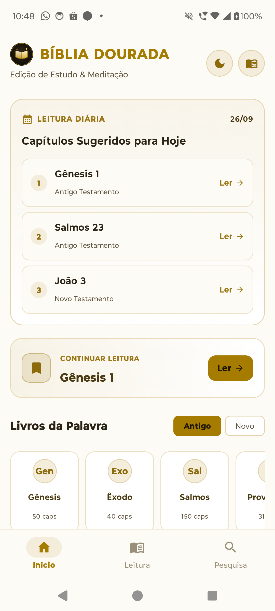
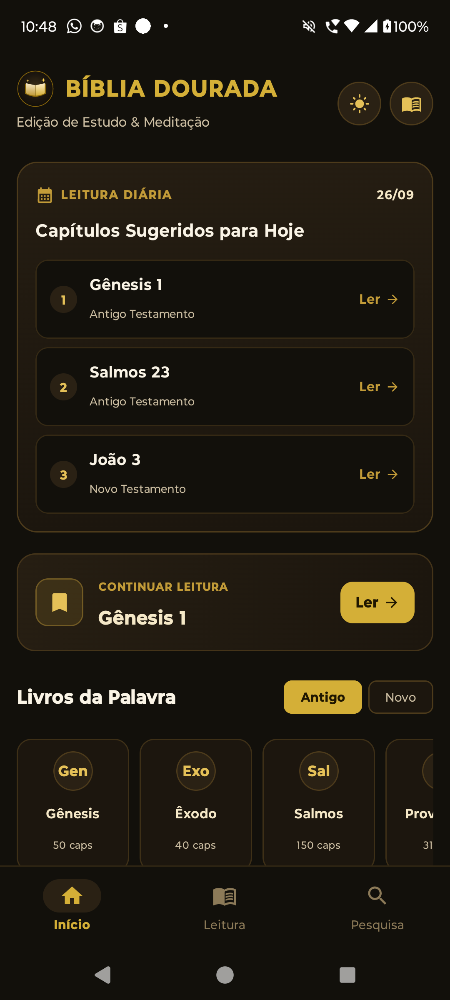
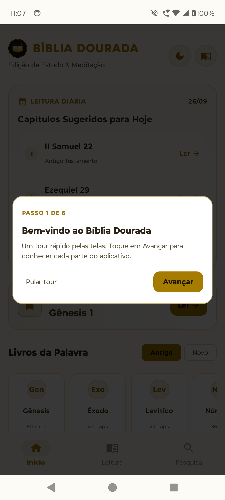
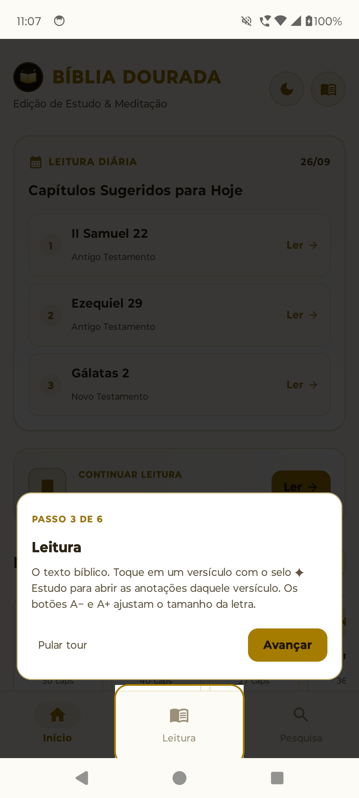
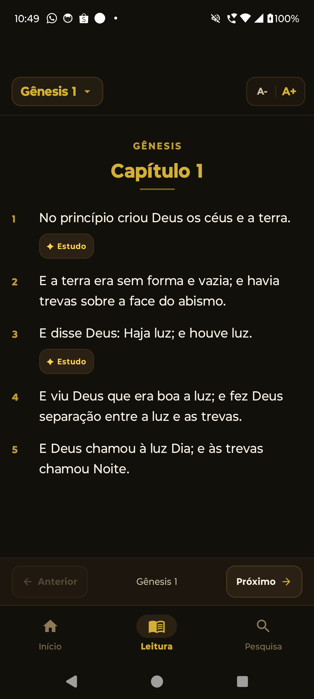
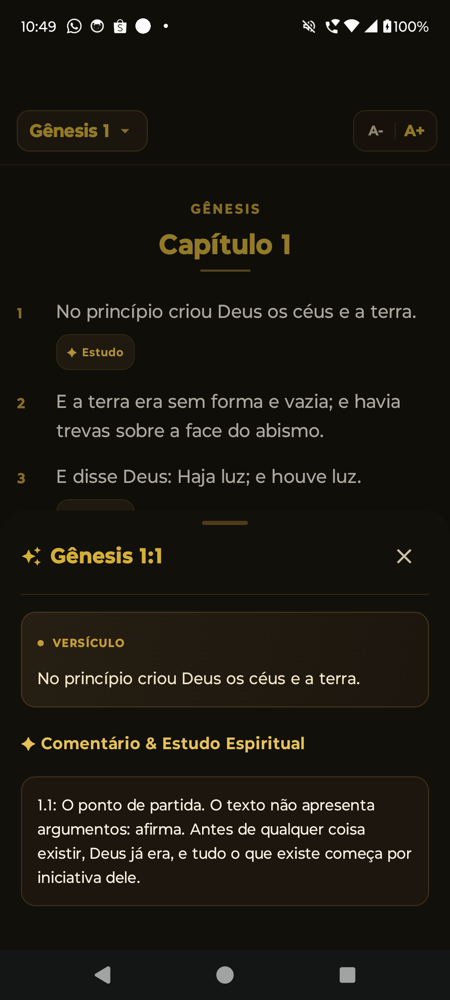
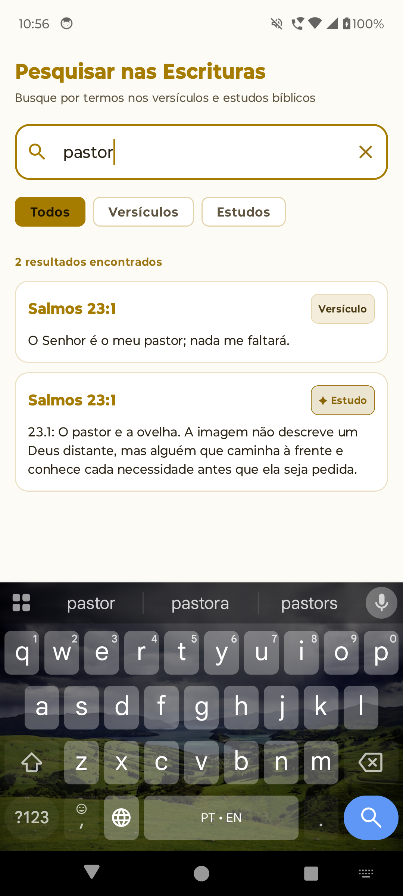
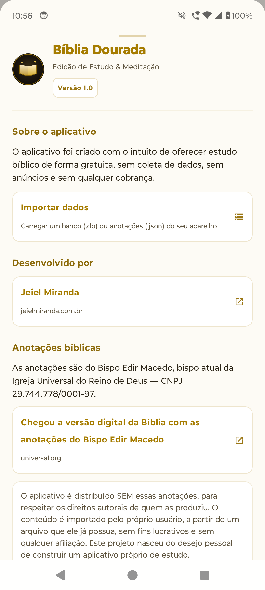
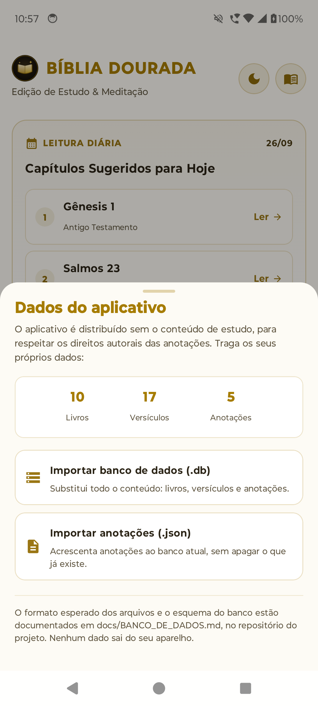
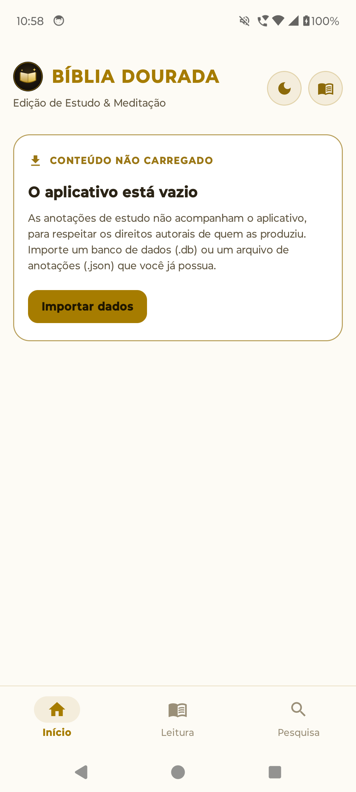

<div align="center">


# Bíblia Dourada

**Leitura bíblica e estudo versículo por versículo — offline, sem anúncios e sem coleta de dados.**


</div>

---

## Sobre

O **Bíblia Dourada** é um aplicativo Android de leitura e meditação da Bíblia.
Todo o processamento acontece no aparelho: não há login, rastreamento,
anúncios ou cobrança.

O aplicativo é distribuído **sem as anotações de estudo** — elas são conteúdo de
terceiros e não são redistribuídas. Em vez disso, o app traz uma ferramenta de
importação para que cada pessoa carregue, no seu próprio aparelho, os dados que
já possua (ver [Banco de dados](docs/BANCO_DE_DADOS.md)).

| | |
|---|---|
|  |  |
| **Início (padrão)** — leitura diária, continuar leitura e atalhos por livro | **Tema escuro** — a alternância fica salva no aparelho |

## Funcionalidades

### Tour de boas-vindas
Na primeira abertura, um tour escurece a tela, recorta cada elemento e explica
para que ele serve: as três abas, o botão de tema e o painel *Sobre e dados*.
Aparece uma única vez e pode ser revisto em **Sobre o aplicativo → Ver o tour
novamente**.

| Boas-vindas | Elemento em foco |
|---|---|
|  |  |

### Leitura
Versículos com numeração destacada, ajuste de tamanho de fonte (A− / A+),
navegação entre capítulos e um seletor rápido de livro/capítulo.

| Leitura | Estudo do versículo |
|---|---|
|  |  |

### Estudo versículo por versículo
Versículos que possuem anotação ganham o selo **✦ Estudo**. Ao toque, sobe um
painel com o texto do versículo e **somente** as anotações correlacionadas
àquele versículo — anotações de capítulo inteiro não se repetem em todos eles.

### Busca
Pesquisa em texto completo (SQLite FTS3) com filtros por **versículos**,
**estudos** ou ambos. Acentos e pontuação são normalizados, então `coracao`
encontra `coração`.



### Dois temas
Paleta dourada sobre fundo **claro** (padrão) ou escuro, com a escolha guardada
entre sessões. A troca é feita pelo ícone sol/lua no cabeçalho.

### Importação de dados
O app começa **vazio** e explica isso na tela inicial. Pelo painel *Dados do
aplicativo* é possível importar um banco `.db` completo ou mesclar anotações de
um `.json` — sempre a partir de um arquivo local escolhido pelo usuário.

| Sobre o aplicativo | Dados do aplicativo | Estado vazio |
|---|---|---|
|  |  |  |

## Como rodar

```bash
# 1. Banco de dados (opcional, não versionado — ver docs/BANCO_DE_DADOS.md)
adb push bible_v2.db /data/local/tmp/bible_v2.db
#    ou coloque em app/src/main/assets/databases/bible_v2.db

# 2. Compilar e instalar
./gradlew assembleDebug
adb install -r app/build/outputs/apk/debug/app-debug.apk
```

Sem o banco o app compila e roda normalmente: ele abre vazio e oferece a
importação.

Para gerar um banco de demonstração e reproduzir os prints deste README:

```bash
python3 tools/gerar_banco_demo.py     # cria build/demo/bible_v2.db
```

## Estrutura

```
app/src/main/java/com/example/bibliadourada/
├── MainActivity.kt              # Activity, abas e composição raiz
├── theme/                       # paletas clara/escura, tipografia
├── ui/
│   ├── BibleViewModel.kt        # estado das telas (StateFlow)
│   ├── screens/                 # Início, Leitura, Pesquisa
│   └── components/              # estudo, seletor de capítulo, sobre, importação
└── data/
    ├── BibleDatabaseHelper.kt   # provisionamento e importação do banco
    ├── BibleRepository.kt       # consultas (livros, capítulos, versículos, busca)
    ├── AnnotationImporter.kt    # importação de anotações em JSON
    └── model/                   # modelos de domínio

docs/                            # documentação
tools/                           # scripts de apoio (ícones, banco de demonstração)
```

## Tecnologia

- **Kotlin** com **Jetpack Compose** e **Material 3**
- **SQLite** direto (sem Room) — um único arquivo, aberto em modo leitura/escrita
- **FTS3** para a busca em texto completo
- **StateFlow** + `AndroidViewModel` para o estado
- Navegação por abas com `Crossfade`, sem biblioteca de navegação

`minSdk 24` · `targetSdk 36` · `compileSdk 36` · Java 17

## Documentação

| Documento | Conteúdo |
|---|---|
| [docs/GUIA.md](docs/GUIA.md) | Guia de uso: cada tela e fluxo, passo a passo |
| [docs/BANCO_DE_DADOS.md](docs/BANCO_DE_DADOS.md) | Esquema do banco, formato JSON e como importar |

## Aviso

As anotações de estudo referenciadas pelo aplicativo são de autoria do Bispo
Edir Macedo (Igreja Universal do Reino de Deus). Este projeto **não possui
vínculo, patrocínio ou afiliação** com a igreja ou com o autor. O aplicativo não
distribui esse conteúdo: a ferramenta de importação existe para que cada usuário
utilize, no seu aparelho, um material que já possua.

Os prints deste README foram gerados com o banco de demonstração
(`tools/gerar_banco_demo.py`), que usa texto de domínio público e anotações
próprias.

Desenvolvido por **Jeiel Miranda** — [jeielmiranda.com.br](https://jeielmiranda.com.br) · JeielMirand@gmail.com
